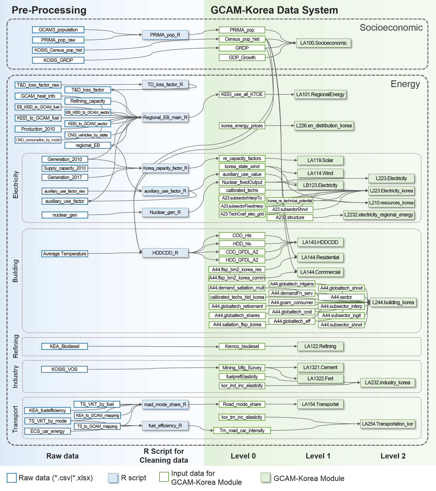
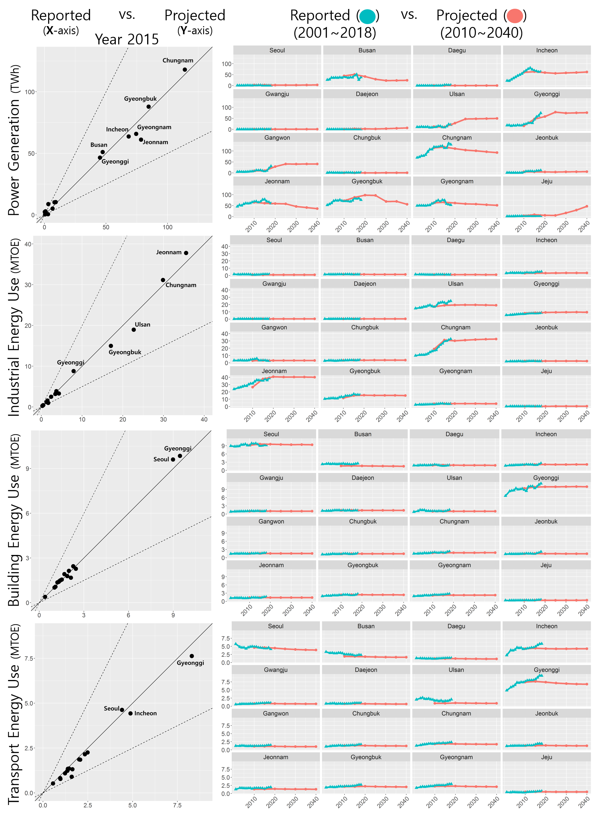
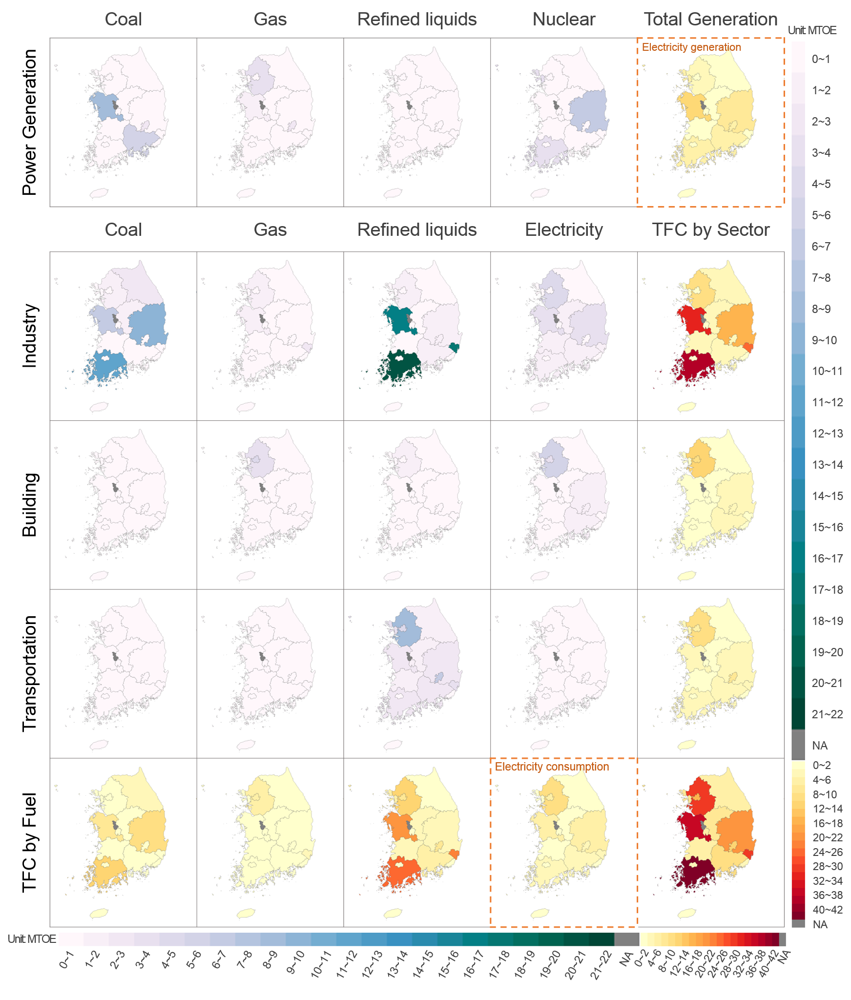

# GCAM-Korea

## What is GCAM-Korea

* GCAM-Korea is for making input files of GCAM, which represents the provincial energy system in Korea. 
* Data structures and R scripts of GCAM-Korea is based on [GCAM-USA](https://github.com/JGCRI/gcam-core).
* GCAM-Korea subdivides Korea energy system into sixteen provinces. GCAM-Korea represents 16 provinces without Sejong province, since there is not enough data to model Sejong separately and just 0.5% of Korea population resides in Sejong.
* Korea provincial data has been collected from [various sources](#Source-of-Data-in-GCAM-Korea). Other data is added by new structures such as nuclear power phase-out policy or modal share in transportation sector, etc.

|<br>|<br>|
|:---:|:---:|
| [Fig 1. Spatial representation of GCAM-Korea](https://github.com/rohmin9122/gcam-korea-release/blob/master/res/map.png) |[Fig 2. GCAM-Korea Data Structure](https://github.com/rohmin9122/gcam-korea-release/blob/master/res/datasystem.png) |

## gcamkordata
#### R Pacakge
* Name of Package: <code>gcamkordata</code>
* Software required: R version 3.1.2 or higher
* Publication: Jeon, S.H, Roh M.Y. and Kim S.D (?) GCAM-Korea: An R package to generate GCAM input files at provincial level.

#### How to install gcamkordata and make input files of GCAM
```R
# Install package
# devtools package must be installed on your PC
devtools::install_github("rohmin9122/gcam-korea-release")

# Start to build all XML files
# XML files will be created in <working directory>/xml
gcamkordata::driver()

# Make a specific XML file
driver(stop_after = "module_gcam.korea_batch_socioeconomics_xml")
```
#### How to simulate GCAM
1. Make XML files according to the above instructions.<br/>
2. Download [GCAM 5.1.3](https://github.com/JGCRI/gcam-core/releases).<br/>
3. Copy XML files and folder in <working dir/xml>, and then paste into <gcam-v5.1.3-Windows-Release-Package/gcamdata/xml>.<br/>
4. An [input configuration file](https://github.com/rohmin9122/gcam-korea-release/blob/master/configuration-gcamkorea.xml) is included in the working directory.<br/> 
5. Please refer to [GCAM 5.1.3 instruction](https://jgcri.github.io/gcam-doc/toc.html) for running GCAM.<br/>


## Model Results
* Some parameters are adjusted to reflect historical performance or the trend of each provinces, such as fuel preference and income-elasticity in 2015 and 2020. 
* From the left hand-side of Fig 1, our model results turned out to be compatible with historical performance. In addition, it is worth noticing from Fig 1 that province-specific socioeconomic and energy features such as population, industrial complex, power plants and airport are well captured. </br>

<p align="center">
  <br>
  <a href="https://github.com/rohmin9122/gcam-korea-release/blob/master/res/trend.png">Fig 1. Reality cehck</a>
</p>


* The building energy consumption of provinces highly depends on the size of population. Seoul (the Capital of Korea) and Gyeonggi (Bedroom suburb for Seoul) accounted for 44% of the national building energy consumption, reflecting the fact that 44% of total population resides in the two provinces.

* In transportation sector, provincial distribution of energy use is similar to that of building sector except for Incheon. Because huge airport and harbors are located, Incheon is the second most transportation energy consuming province in Korea. 

* In industrial sector, four provinces (Jeonnam, Chungnam, Ulsan and Gyeongbuk) with huge industrial complexes consume 77% of the national industrial energy. The industrial complexes include oil refineries and steel production companies, which are ranked 5th and 6th largest industry in the world, respectively.

* In power generation sector, it is notable that base-load power plants are coal and nuclear power in Korea. In non-metropolitan area such as Chungnam, electricity is generated and then transmitted to other metropolitan areas.

<p align="center">
  <br>
  <a href="https://github.com/rohmin9122/gcam-korea-release/blob/master/res/TFC2015.png">Fig 2. Total final energy consumption by sectors and fuels.<br>In the last row, electricity generation by fuels in 2015</a>
</p>

## Reference
Jeon, S., Roh, M., Oh, J., & Kim, S. (2020). Development of an Integrated Assessment Model at Provincial Level: GCAM-Korea. Energies, 13(10), 2565. Available online: https://doi.org/10.3390/en13102565

## Source of Data in GCAM-Korea
<!--<style>
table {
  font-size: 12px;
  top:50%;
  left:50%;
}
</style>-->
|Data|Data Year|Source|URL|
|:-|:-:|:-|:-|
|Population|1970-2045|KOSIS, Population Projections and Summary indicators (Province)|http://kosis.kr/statHtml/statHtml.do?orgId=101&tblId=DT_1BPB002&conn_path=I3|
|GRDP|1975-2017|KOSIS, Gross regional domestic product per Capita by Provinc|http://kosis.kr/statHtml/statHtml.do?orgId=101&tblId=DT_1C65&conn_path=I3|
|Regional Energy balance|2011|KEEI|Internal infromation|
|Generation from renewable|2017|KEA, New & Renewable Energy Supply Statistics 2017|https://www.knrec.or.kr/pds/statistics_read.aspx?no=78&searchfield=&searchword=&page=1|
|Wind resource |2017|KEA, New & Renewable Energy Supply Statistics 2017|https://www.knrec.or.kr/pds/statistics_read.aspx?no=78&searchfield=&searchword=&page=1|
|Renewable capacity factor|2017|KEA, New & Renewable Energy Supply Statistics 2017|https://www.knrec.or.kr/pds/statistics_read.aspx?no=78&searchfield=&searchword=&page=1|
|Biodiesel supply| 2017|KEA, New & Renewable Energy Supply Statistics 2017|https://www.knrec.or.kr/pds/statistics_read.aspx?no=78&searchfield=&searchword=&page=1|
|Refining capacity| |KNOC|http://www.petronet.co.kr/main2.jsp|
|T&D loss factor| 1961, 2000-2017|KEPCO, Statistics of Electric Power in Korea 2017|http://home.kepco.co.kr/kepco/KO/ntcob/list.do?boardCd=BRD_000099&menuCd=FN05030103|
|Auxiliary use factor| 1961, 2000-2017|KEPCO, Statistics of Electric Power in Korea 2017|http://home.kepco.co.kr/kepco/KO/ntcob/list.do?boardCd=BRD_000099&menuCd=FN05030103|
|Nuclear plant information |1990-2018 |KHNP, Design Lifetime of Nuclear Power Plant| http://nsic.nssc.go.kr/intrst/view.do?ppleIntrstInfoSn=22|
|Value of shipment of cement and fertilizer|2011|KOSIS, Mining and Manufacturing Survey 2011|http://kosis.kr/publication/publicationThema.do?pubcode=FE |
|Vehicle energyconsumption|2010|KEEI (Energy Consumption Survey), TS (Automobile Mileage Analysis)|
|Vehicle Kilometer|2010|KEA, 건물·수송부문 온실가스 감축수단 Pool 구축|
|Vehicle Loadfactor|2010, 2015|KOTI, Statistical yearbook of MOLIT 2018| http://stat.molit.go.kr/portal/stat/yearReport.do|
|Temperature|1975-2015|KMA, Average temperature|https://data.kma.go.kr/stcs/grnd/grndTaList.do?pgmNo=70|
|Floor space|2011|MOLIT, Open Building Data|http://open.eais.go.kr/|

<!--[Supplementary file]()-->
